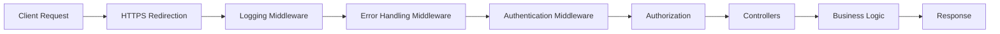

<div align="center">

# 🛡️ Certificate Middleware Project

### *Secure, Scalable, and Smart User Management API*

[](https://dotnet.microsoft.com/)
[](https://docs.microsoft.com/en-us/dotnet/csharp/)
[](https://dotnet.microsoft.com/apps/aspnet)
[](https://swagger.io/)

---

**A production-ready ASP.NET Core Web API featuring custom middleware architecture for authentication, logging, and error handling.**

[Features](#-features) • [Architecture](#-architecture) • [Quick Start](#-quick-start) • [API Documentation](#-api-documentation) • [Middleware](#-middleware-pipeline) • [Contributing](#-contributing)

</div>

---

## 🌟 Features

<table>
<tr>
<td width="50%">

### 🔐 Security First
- **Custom Authentication Middleware**
- Certificate-based authentication
- Secure request validation
- Authorization pipeline integration

</td>
<td width="50%">

### 📊 Observability
- **Comprehensive Logging Middleware**
- Request/Response tracking
- Performance monitoring
- Detailed error diagnostics

</td>
</tr>
<tr>
<td width="50%">

### 🚀 Developer Experience
- RESTful API design
- Swagger/OpenAPI documentation
- Clean architecture principles
- Easy to extend and maintain

</td>
<td width="50%">

### 🛠️ Production Ready
- **Global Error Handling**
- Graceful exception management
- Structured error responses
- HTTPS enforcement

</td>
</tr>
</table>

---

## 🏗️ Architecture



### 📁 Project Structure

```
certificatemiddlewareproject/
├── 📂 Controllers/
│   └── UsersController.cs          # User management endpoints
├── 📂 Middleware/
│   ├── AuthenticationMiddleware.cs # Custom auth logic
│   ├── ErrorHandlingMiddleware.cs  # Global error handler
│   └── LoggingMiddleware.cs        # Request/response logger
├── Program.cs                       # Application entry point
└── UserManagementAPI.csproj         # Project configuration
```

---

## 🚀 Quick Start

### Prerequisites

- [.NET 6.0+](https://dotnet.microsoft.com/download) SDK installed
- Your favorite IDE (Visual Studio, VS Code, Rider)
- Basic understanding of ASP.NET Core

### Installation

1. **Clone the repository**
   ```bash
   git clone https://github.com/tugrahanguler/certificatemiddlewareproject.git
   cd certificatemiddlewareproject
   ```

2. **Restore dependencies**
   ```bash
   dotnet restore
   ```

3. **Build the project**
   ```bash
   dotnet build
   ```

4. **Run the application**
   ```bash
   dotnet run
   ```

5. **Access Swagger UI**
   ```
   https://localhost:5001/swagger
   ```

---

## 📚 API Documentation

### User Management Endpoints

| Method | Endpoint | Description | Auth Required |
|--------|----------|-------------|---------------|
| `GET` | `/api/users` | Get all users | ✅ |
| `GET` | `/api/users/{id}` | Get user by ID | ✅ |
| `POST` | `/api/users` | Create new user | ✅ |
| `PUT` | `/api/users/{id}` | Update user | ✅ |
| `DELETE` | `/api/users/{id}` | Delete user | ✅ |

### Example Request

```bash
curl -X POST "https://localhost:5001/api/users" \
     -H "Content-Type: application/json" \
     -H "Authorization: Bearer YOUR_TOKEN" \
     -d '{
       "name": "John Doe",
       "email": "john@example.com"
     }'
```

### Example Response

```json
{
  "id": 1,
  "name": "John Doe",
  "email": "john@example.com",
  "createdAt": "2025-11-18T09:56:00Z"
}
```

---

## 🔧 Middleware Pipeline

### 1️⃣ Logging Middleware

Captures and logs every incoming request and outgoing response.

**Features:**
- Request method, path, and timestamp
- Response status codes
- Execution time tracking
- Console and file logging support

### 2️⃣ Error Handling Middleware

Provides global exception handling with structured error responses.

**Features:**
- Catches unhandled exceptions
- Returns consistent error format
- Prevents sensitive data leakage
- Logs errors for debugging

**Error Response Format:**
```json
{
  "error": "Error message",
  "statusCode": 500,
  "timestamp": "2025-11-18T09:56:00Z",
  "path": "/api/users"
}
```

### 3️⃣ Authentication Middleware

Implements custom authentication logic for secure API access.

**Features:**
- Certificate-based authentication
- Token validation
- Custom authentication schemes
- Seamless integration with ASP.NET Core Identity

---

## 🎯 Use Cases

- 🏢 **Enterprise Applications**: Secure user management for corporate systems
- 🔐 **Certificate-Based Auth**: Systems requiring PKI authentication
- 📱 **Mobile Backend**: RESTful API for mobile applications
- 🌐 **Microservices**: Reusable middleware patterns for distributed systems

---

## 🛠️ Technology Stack

| Category | Technology |
|----------|-----------|
| **Framework** | ASP.NET Core 6.0+ |
| **Language** | C# 10.0+ |
| **API Documentation** | Swagger/OpenAPI |
| **Architecture** | Middleware Pipeline Pattern |
| **Authentication** | Custom Middleware |

---

## 📖 Learning Resources

This project demonstrates:

- ✅ Custom middleware development in ASP.NET Core
- ✅ Middleware pipeline configuration
- ✅ RESTful API best practices
- ✅ Global error handling patterns
- ✅ Logging and monitoring strategies
- ✅ Clean code principles

---

## 🤝 Contributing

Contributions are what make the open-source community amazing! Any contributions you make are **greatly appreciated**.

1. Fork the Project
2. Create your Feature Branch (`git checkout -b feature/AmazingFeature`)
3. Commit your Changes (`git commit -m 'Add some AmazingFeature'`)
4. Push to the Branch (`git push origin feature/AmazingFeature`)
5. Open a Pull Request

---

## 📝 License

Distributed under the MIT License. See `LICENSE` file for more information.

---

## 👨‍💻 Author

**Tuğrahan Güler**

- GitHub: [@tugrahanguler](https://github.com/tugrahanguler)

---

## 🌟 Show Your Support

Give a ⭐️ if this project helped you learn something new!

---

<div align="center">

### 💡 *Built with passion for clean architecture and secure APIs*

**[⬆ Back to Top](#️-certificate-middleware-project)**

</div>
